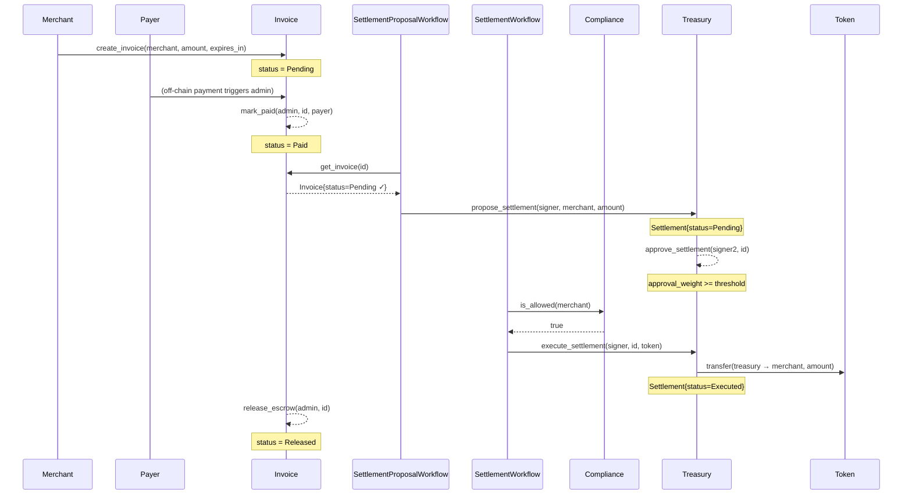

# Architecture

This document describes the protocol-level design of the COMEBACKHERE smart contracts, their data storage, and how they interact during a typical payment lifecycle.

## Contracts

| Contract | Crate path | Responsibility |
|---|---|---|
| **Invoice** | `contracts/invoice` | Invoice state machine and escrow lifecycle |
| **Treasury** | `contracts/treasury` | 2-of-3 multi-sig settlement approval and token transfer |
| **Compliance** | `contracts/compliance` | Admin-managed allow/block list for addresses |
| **SettlementWorkflow** | `contracts/settlement-workflow` | Gates `Treasury::execute_settlement` behind `Compliance::is_allowed` |

---

## Payment Lifecycle — Mermaid Sequence Diagram



> **Note:** `SettlementProposalWorkflow` is a deliberately off-chain/intermediary role — no such contract is deployed in this repo. Deciding that an invoice has reached `Paid` and is ready for a settlement proposal is an off-chain (or admin-triggered) judgment call today, not an on-chain invariant enforced between Invoice and Treasury; `Invoice::get_invoice` and `Treasury::propose_settlement` remain independently callable, and it is the caller's responsibility to sequence them correctly. See `contracts/treasury/tests/invoice_status_settlement_proposal_integration_test.rs` for a test-only contract that exercises this exact sequencing without asserting it belongs on-chain.
>
> `SettlementWorkflow`, by contrast, **is** an on-chain contract: `contracts/settlement-workflow` implements the compliance gate described here, calling `Compliance::is_allowed` before `Treasury::execute_settlement` so a non-compliant merchant is rejected with a typed `TreasuryError::ComplianceCheckFailed` instead of reaching Treasury at all. Treasury itself still does **not** call Compliance directly — enforcement lives in this workflow contract, not in Treasury.

---

## DataKey Storage Reference

### Invoice (`contracts/invoice`)

| DataKey | Storage | Type | Description |
|---|---|---|---|
| `Admin` | Instance | `Address` | Contract administrator |
| `InvoiceCount` | Instance | `u64` | Monotonic invoice ID counter |
| `Paused` | Instance | `bool` | Circuit-breaker flag |
| `GraceWindow` | Instance | `u64` | Seconds added to `expires_at` during `mark_paid` |
| `Invoice(u64)` | Persistent | `Invoice` | Full invoice record keyed by ID |
| `MerchantNonce(Address, u64)` | Persistent | `bool` | Idempotency guard; rejects duplicate merchant nonces |

### Treasury (`contracts/treasury`)

| DataKey | Storage | Type | Description |
|---|---|---|---|
| `Admin` | Instance | `Address` | Contract administrator |
| `Threshold` | Instance | `u32` | Minimum approval weight to execute a settlement |
| `SettlementCount` | Instance | `u64` | Monotonic settlement ID counter |
| `Signer(Address)` | Instance | `u32` | Signing weight per authorized signer |
| `Paused` | Instance | `bool` | Circuit-breaker flag |
| `DisputeCount` | Instance | `u64` | Monotonic dispute ID counter |
| `RotationCount` | Instance | `u64` | Monotonic signer-rotation proposal counter |
| `TokenAllowlist` | Instance | `Vec<Address>` | Approved token contracts for settlement |
| `MerchantPayoutAddress(Address)` | Instance | `Address` | Override payout address per merchant |
| `Settlement(u64)` | Persistent | `Settlement` | Settlement record keyed by ID |
| `Dispute(u64)` | Persistent | `Dispute` | Dispute record keyed by ID |
| `Balance(Address)` | Persistent | `i128` | Deposited balance per depositor |
| `SignerRotation(u64)` | Persistent | `SignerRotationProposal` | Signer rotation proposal keyed by ID |

### Compliance (`contracts/compliance`)

| DataKey | Storage | Type | Description |
|---|---|---|---|
| `Admin` | Instance | `Address` | Contract administrator |
| `PendingAdmin` | Instance | `Address` | Pending admin for two-step transfer |
| `Paused` | Instance | `bool` | Circuit-breaker flag (allow/block ops disabled; `block_address` still permitted) |
| `AddressIndex` | Instance | `Vec<Address>` | Index of all tracked addresses for `export_snapshot` |
| `Allowed(Address)` | Persistent | `bool` | Whether an address is on the allow-list |
| `Blocked(Address)` | Persistent | `bool` | Whether an address is blocked (overrides allow) |
| `AllowedUntil(Address)` | Persistent | `u64` | Optional expiry timestamp for a temporary allow |

---

## Cross-Contract Call Map

```
SettlementProposalWorkflow (off-chain/intermediary role — not a deployed contract)
  ├── Invoice::get_invoice(id)              → validates status == Pending
  └── Treasury::propose_settlement(...)     → creates Settlement record

SettlementWorkflow (on-chain — contracts/settlement-workflow)
  ├── Compliance::is_allowed(merchant)      → compliance gate (must be true)
  └── Treasury::execute_settlement(...)     → transfers tokens to merchant

Treasury::execute_settlement
  └── Token::transfer(treasury → merchant)  → SEP-41 token transfer

Invoice (standalone — no outbound cross-contract calls)
Treasury (standalone — no outbound cross-contract calls except Token)
Compliance (standalone — no outbound cross-contract calls)
```

### Cross-Contract Compliance Call Failure Modes

Soroban cross-contract calls have no network-style timeout or retry — a call either
returns synchronously within the same transaction or the invocation aborts. This
documents how the calling contract (`Treasury`, via `compliance-client`) reacts to
each failure mode when invoking `Compliance::is_allowed`:

| Failure mode | Behavior | Caller impact |
|---|---|---|
| Compliance contract not deployed / wrong contract ID | The host call fails immediately (no such contract instance) | The calling transaction aborts entirely; all state changes made earlier in the same transaction (e.g. a prior `Treasury` write) are rolled back. There is no partial-execution state to clean up. |
| Compliance contract paused | `is_allowed` does not check the `Paused` flag — only administrative mutations (`allow_address`, `block_address`, etc.) enforce `require_not_paused`. `is_allowed` still executes and returns its normal `bool` result while paused. | No special handling needed; a pause does not block compliance reads, only compliance list mutations. |
| Compliance contract panics (unexpected internal error) | The panic propagates up through the cross-contract call boundary | The calling transaction aborts entirely, identical to a missing-contract failure. Soroban provides no automatic retry — the caller (or off-chain orchestrator driving `SettlementWorkflow`) must resubmit a fresh transaction after the underlying issue is resolved. |

Because there is no retry/backoff primitive at the protocol level, any retry policy
(e.g. re-attempting `execute_settlement` after a transient compliance failure) must
be implemented off-chain by whatever process submits these transactions.

### Invoice Status State Machine

```
Pending ──mark_paid──► Paid ──release_escrow──► Released
   │                     │
   │ cancel_invoice       └── request_refund ──► RefundRequested
   ▼
Cancelled

Pending ──batch_expire──► Expired  (when ledger.timestamp >= expires_at)
```

### Invoice Status Audit Trail

Off-chain indexers reconstruct the chronological status history for each invoice
from the invoice contract's emitted events, using the invoice ID topic as the
stream key. `invoice_created`, `invoice_paid`, `invoice_expired`,
`invoice_cancelled`, `invoice_refund_requested`, and `refund_approved` carry the
resulting full `Invoice`; `escrow_released` carries the invoice ID, merchant,
amount, and release timestamp. Consumers must process events in ledger/event
order, checkpoint their position, and deduplicate replayed events. The current
state can be reconciled with `get_invoice` or the `batch_get_invoice_status`
entrypoint.
